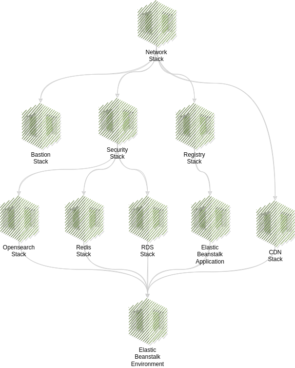
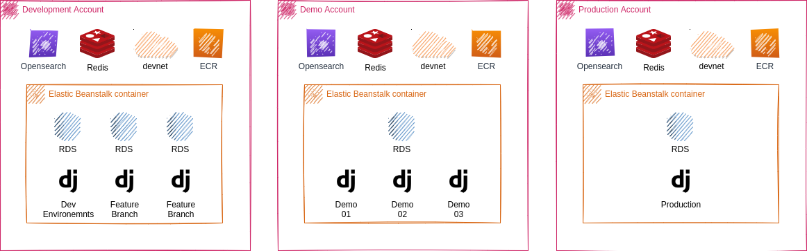
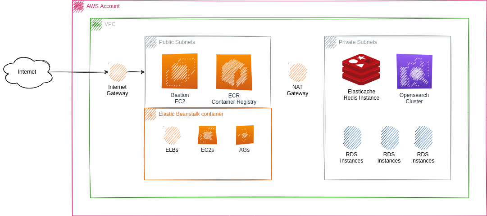

# AWS CDK Elastic Beanstalk Automation


## References

- [AWS CDK Toolkit (cdk command](https://docs.aws.amazon.com/cdk/v2/guide/cli.html)

## Architecture







## Instructions

### Install python libraries
```bash
virtualenv -p python3 .env
source .env/bin/activate
pip install -r requirements.txt
```

### Build Docker image
```bash
docker build -t martin/flask:latest .
```

### Install node dependencies
```bash
npm install
```

### Bootstrap the AWS Accounts only once
```bash
node_modules/aws-cdk/bin/cdk bootstrap --profile "mp-dev"
node_modules/aws-cdk/bin/cdk bootstrap --profile "mp-demo"
node_modules/aws-cdk/bin/cdk bootstrap --profile "mp-prod"
```

### Deploying a new development environment
```bash
node_modules/aws-cdk/bin/cdk deploy \
    --profile "mp-dev" \
    -c debug="true" \
    -c profile="mp-dev" \
    -c application="mp" \
    -c network="devnet" \
    -c database="devmartindb" \
    -c environment="devmartin" \
    ----require-approval "never" \
    --all
```

### Destroying the development environment
```bash
node_modules/aws-cdk/bin/cdk destroy \
    --profile "mp-dev" \
    -c debug="true" \
    -c profile="mp-dev" \
    -c application="mp" \
    -c network="devnet" \
    -c database="devmartindb" \
    -c environment="devmartin" \
    ----require-approval "never" \
    --all
```

### Deploying 2 demo environments that share the same database
```bash
node_modules/aws-cdk/bin/cdk deploy \
    --profile "mp-demo" \
    -c debug="true" \
    -c profile="mp-demo" \
    -c application="mp" \
    -c network="testnet" \
    -c database="demodb" \
    -c environment="demo01" \
    ----require-approval "never" \
    --all
node_modules/aws-cdk/bin/cdk deploy \
    --profile "mp-demo" \
    -c profile="mp-demo" \
    -c debug="true" \
    -c application="mp" \
    -c network="testnet" \
    -c database="demodb" \
    -c environment="demo01" \
    ----require-approval "never" \
    --all
```

### Deploying the production environment
```bash
node_modules/aws-cdk/bin/cdk deploy \
    --profile "mp-prod" \
    -c debug="true" \
    -c profile="mp-prod" \
    -c application="mp" \
    -c network="mainnet" \
    -c database="proddb" \
    -c environment="production" \
    ----require-approval "never" \
    --all
```

### Deploying from AWS ECR to AWS Elastic Beanstalk
```bash
aws s3 cp \
    --profile "mp-dev" \
    /tmp/devmartin.json \
    s3://mp-767087296931-deployments-bucket/Dockerrun.aws.json
aws elasticbeanstalk create-application-version \
    --profile "mp-dev" \
    --application-name "mp" \
    --version-label "${VERSION}" \
    --source-bundle "S3Bucket=mp-767087296931-deployments-bucket,S3Key=Dockerrun.aws.json"
aws elasticbeanstalk \
    update-environment \
    --profile "mp-dev" \
    --application-name "mp" \
    --version-label "${VERSION}" \
    --environment-name "devmartin"
```
